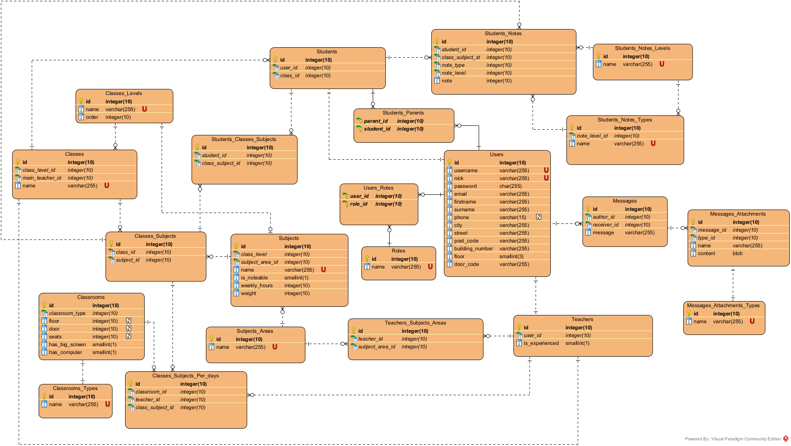
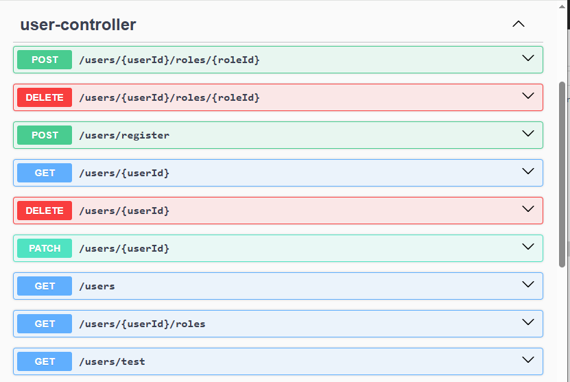
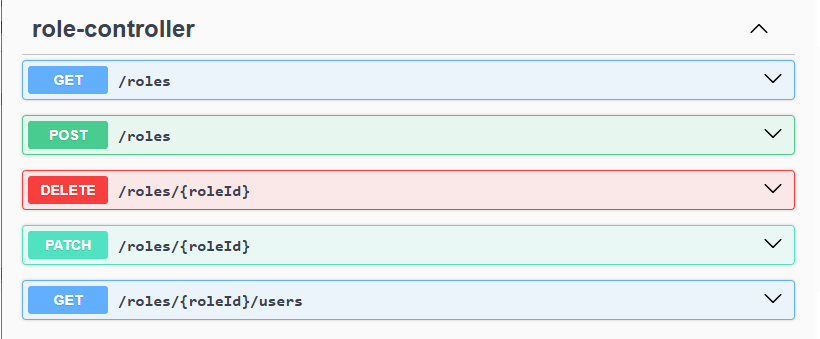
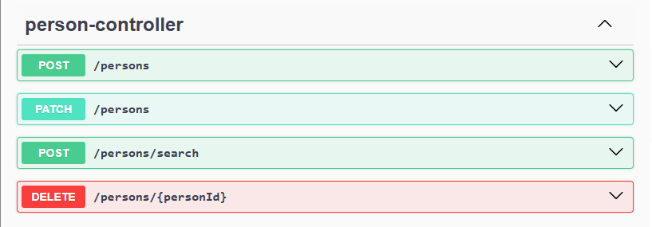
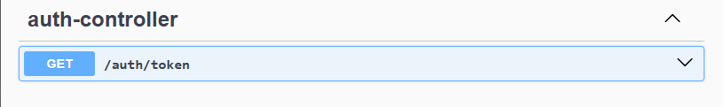
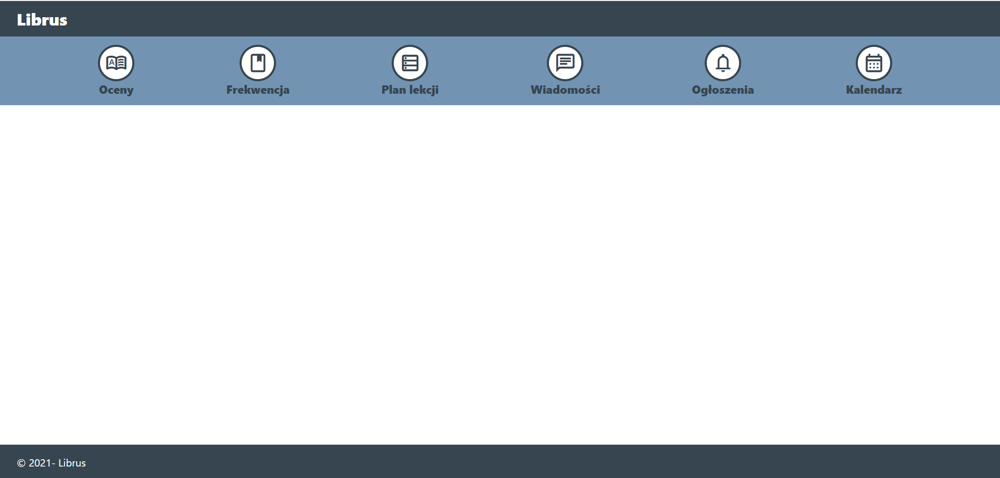

# Librus

Prosta aplikacja webowa dla nauki skupiona przede wszystkim na możliwości wystawiania ocen uczniom. Następnie oceny ucznia będą mogły być sprawdzone przez niego samego oraz przez jego rodziców.

## Wymagania funkcjonalne:
* Logowanie,
* Rejestracja,
* Przeglądanie przedmiotów,
* Przeglądanie nauczycieli,
* Przeglądanie uczniów,
* Przegladanie ocen,
* Zarządzanie ocenami,
* Czat w czasie rzeczywistym,
* Powiadomienia o wystawieniu ocen,
* Zarządzanie klasami,
* Zarządzanie listą uczniów w klasie,
* Automatyczne tworzenie planu lekcji,
* Tworzenie automatyczne planu lekcji na każdy tydzień np. uwzględniane będą ewentualne zmiany sal, czy zastępstwa,
* Przypisywanie uczniów do przedmiotów,
* Zarządzanie listą przedmiotów o danym poziomie klasy np. klasa pierwsza,
* Automatyczne przypisywanie sali do lekcji odbywanych się w danym dniu.

## Wymagania niefunkcjonalne:
* Logowanie przez Oauth 2.0,
* Technologie:
    - Java 17,
    - Spring Boot,
    - Hibernate,
    - Spring Data Jpa,
    - Spring Security,
    - SQL,
    - PostgreSQL,
    - React,
    - TypeScript,
    - Context Api,
    - Docker,
    - Kubernetes,
    - Rest,
    - Git.

## Role:
* Administrator - zarządzanie zasobami w systemie,
* Nauczyciel - zarządzanie ocenami i czat z innymi nauczycielami i rodzicami,
* Uczeń - przeglądanie swoich ocen i czat z nauczycielami,
* Rodzic - przeglądanie ocen swoich dzieci oraz czat z rodzicami oraz nauczycielami.

## Diagram związków encji:

    

## Postępy:

### Backend:

#### Użytkownicy

    

#### Role

    

#### Osoby

    

#### Bezpieczeństwo

    

### Frontend

    

